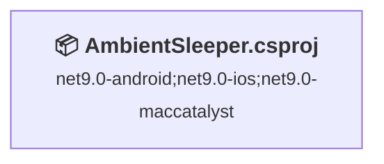
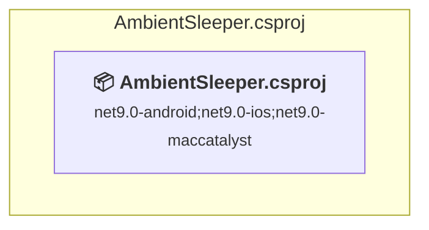

# Projects and dependencies analysis

This document provides a comprehensive overview of the projects and their dependencies in the context of upgrading to .NETCoreApp,Version=v10.0.

## Table of Contents

- [Executive Summary](#executive-Summary)
  - [Highlevel Metrics](#highlevel-metrics)
  - [Projects Compatibility](#projects-compatibility)
  - [Package Compatibility](#package-compatibility)
  - [API Compatibility](#api-compatibility)
- [Aggregate NuGet packages details](#aggregate-nuget-packages-details)
- [Top API Migration Challenges](#top-api-migration-challenges)
  - [Technologies and Features](#technologies-and-features)
  - [Most Frequent API Issues](#most-frequent-api-issues)
- [Projects Relationship Graph](#projects-relationship-graph)
- [Project Details](#project-details)

  - [AmbientSleeper.csproj](#ambientsleepercsproj)

## Executive Summary

### Highlevel Metrics

| Metric | Count | Status |
| :--- | :---: | :--- |
| Total Projects | 1 | All require upgrade |
| Total NuGet Packages | 7 | All compatible |
| Total Code Files | 184 |  |
| Total Code Files with Incidents | 12 |  |
| Total Lines of Code | 23102 |  |
| Total Number of Issues | 40 |  |
| Estimated LOC to modify | 39+ | at least 0.2% of codebase |

### Projects Compatibility

| Project | Target Framework | Difficulty | Package Issues | API Issues | Est. LOC Impact | Description |
| :--- | :---: | :---: | :---: | :---: | :---: | :--- |
| [AmbientSleeper.csproj](#ambientsleepercsproj) | net9.0-android;net9.0-ios;net9.0-maccatalyst | 🟢 Low | 0 | 39 | 39+ | ClassLibrary, Sdk Style = True |

### Package Compatibility

| Status | Count | Percentage |
| :--- | :---: | :---: |
| ✅ Compatible | 7 | 100.0% |
| ⚠️ Incompatible | 0 | 0.0% |
| 🔄 Upgrade Recommended | 0 | 0.0% |
| ***Total NuGet Packages*** | ***7*** | ***100%*** |

### API Compatibility

| Category | Count | Impact |
| :--- | :---: | :--- |
| 🔴 Binary Incompatible | 0 | High - Require code changes |
| 🟡 Source Incompatible | 39 | Medium - Needs re-compilation and potential conflicting API error fixing |
| 🔵 Behavioral change | 0 | Low - Behavioral changes that may require testing at runtime |
| ✅ Compatible | 16644 |  |
| ***Total APIs Analyzed*** | ***16683*** |  |

## Aggregate NuGet packages details

| Package | Current Version | Suggested Version | Projects | Description |
| :--- | :---: | :---: | :--- | :--- |
| CommunityToolkit.Maui | 12.2.0 |  | [AmbientSleeper.csproj](#ambientsleepercsproj) | ✅Compatible |
| CommunityToolkit.Mvvm | 8.4.0 |  | [AmbientSleeper.csproj](#ambientsleepercsproj) | ✅Compatible |
| Microsoft.Extensions.Logging.Debug | 9.0.9 |  | [AmbientSleeper.csproj](#ambientsleepercsproj) | ✅Compatible |
| Microsoft.Maui.Controls | 9.0.110 |  | [AmbientSleeper.csproj](#ambientsleepercsproj) | ✅Compatible |
| Plugin.LocalNotification | 12.0.2 |  | [AmbientSleeper.csproj](#ambientsleepercsproj) | ✅Compatible |
| Plugin.Maui.AppRating | 1.2.2 |  | [AmbientSleeper.csproj](#ambientsleepercsproj) | ✅Compatible |
| Plugin.Maui.Audio | 4.0.0 |  | [AmbientSleeper.csproj](#ambientsleepercsproj) | ✅Compatible |

## Top API Migration Challenges

### Technologies and Features

| Technology | Issues | Percentage | Migration Path |
| :--- | :---: | :---: | :--- |

### Most Frequent API Issues

| API | Count | Percentage | Category |
| :--- | :---: | :---: | :--- |
| M:System.TimeSpan.FromSeconds(System.Int64) | 14 | 35.9% | Source Incompatible |
| M:System.TimeSpan.FromMinutes(System.Int64) | 10 | 25.6% | Source Incompatible |
| M:System.TimeSpan.FromMilliseconds(System.Int64,System.Int64) | 9 | 23.1% | Source Incompatible |
| M:System.TimeSpan.FromMilliseconds(System.Double) | 3 | 7.7% | Source Incompatible |
| M:System.TimeSpan.FromHours(System.Int32) | 2 | 5.1% | Source Incompatible |
| M:System.TimeSpan.FromMinutes(System.Double) | 1 | 2.6% | Source Incompatible |

## Projects Relationship Graph

Legend:
📦 SDK-style project
⚙️ Classic project

## Project Details

### AmbientSleeper.csproj

#### Project Info

- **Current Target Framework:** net9.0-android;net9.0-ios;net9.0-maccatalyst
- **Proposed Target Framework:** net9.0-android;net9.0-ios;net9.0-maccatalyst;net10.0-ios;net10.0-android;net10.0-maccatalyst
- **SDK-style**: True
- **Project Kind:** ClassLibrary
- **Dependencies**: 0
- **Dependants**: 0
- **Number of Files**: 193
- **Number of Files with Incidents**: 12
- **Lines of Code**: 23102
- **Estimated LOC to modify**: 39+ (at least 0.2% of the project)

#### Dependency Graph

Legend:
📦 SDK-style project
⚙️ Classic project

### API Compatibility

| Category | Count | Impact |
| :--- | :---: | :--- |
| 🔴 Binary Incompatible | 0 | High - Require code changes |
| 🟡 Source Incompatible | 39 | Medium - Needs re-compilation and potential conflicting API error fixing |
| 🔵 Behavioral change | 0 | Low - Behavioral changes that may require testing at runtime |
| ✅ Compatible | 16644 |  |
| ***Total APIs Analyzed*** | ***16683*** |  |

